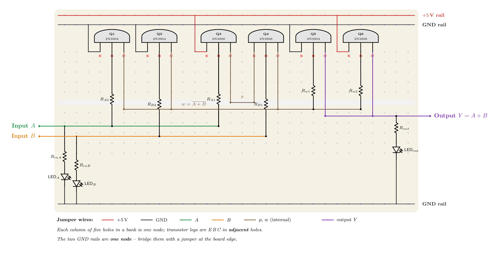

# OR Gate

An OR gate outputs `1` **when at least one input is `1`** (`Y = A + B`).

It is built the simplest way — a **NOR gate followed by a NOT gate** — so there is nothing new
to design at the transistor level. Both sub-gates already exist in this project: the
[`nor`](https://github.com/mrmhmdalmalki/nor-gate) stage and the
[`not`](https://github.com/mrmhmdalmalki/not-gate) stage. The whole gate — all **6
transistors** — fits on **one half-size (400-point) breadboard**, with indicator LEDs on the
external inputs and output only.

### Symbol


### Truth table

| `A` | `B` | `Y` |
|:---:|:---:|:---:|
| 0 | 0 | 0 |
| 0 | 1 | 1 |
| 1 | 0 | 1 |
| 1 | 1 | 1 |

`Y = A + B`

---

## How it is built

> OR = NOT( NOR(A, B) ) = A + B

A NOR gate gives `NOT(A+B)`; inverting it with a NOT gate gives `A+B`. Both stages use the
complementary (2N3904 + 2N3906) design, so the output is driven to a clean, strong
`~4.8 V` / `~0.2 V`.


---

## Building it on a breadboard

The whole OR gate — **6 transistors** — fits on **one half-size (400-point) breadboard**. All
six share the same TO-92 pinout (flat face toward you, legs down, **E B C** left to right),
and here the legs sit in **adjacent holes**:


The wiring picture below is the actual breadboard build, every connection a **colour-coded
jumper** (see the legend). Each column of five holes in a bank is one node. The **top rail
pair** carries `+5 V` (outer) and `GND` (inner) for the transistor emitters; the **bottom
rail** is `GND` for the LED returns — the two GND rails are **one node**, so bridge them with
a jumper at the board edge.



Connect the six transistors as follows (Q1–Q4 are the NOR stage, Q5–Q6 the NOT stage):

| Transistor | E (emitter) | B (base) | C (collector) |
|:-----------|:------------|:---------|:--------------|
| **Q1 — 2N3904 (NPN, parallel)** | **GND** | through R_A2 (10 kΩ) to Input `A` | node `w` |
| **Q2 — 2N3904 (NPN, parallel)** | **GND** | through R_B2 (10 kΩ) to Input `B` | node `w` |
| **Q3 — 2N3906 (PNP, top of series)** | **+5 V** | through R_A1 (10 kΩ) to Input `A` | joined to Q4's emitter (node *p*) |
| **Q4 — 2N3906 (PNP, bottom of series)** | joined to Q3's collector (node *p*) | through R_B1 (10 kΩ) to Input `B` | node `w` |
| **Q5 — 2N3904 (NPN, NOT stage)** | **GND** | through R_w1 (10 kΩ) to node `w` | **Output Y** |
| **Q6 — 2N3906 (PNP, NOT stage)** | **+5 V** | through R_w2 (10 kΩ) to node `w` | **Output Y** |

The internal node `w = ‾A+B` (the NOR stage's output, the NOT stage's input) is a **plain
jumper run** — no LED. Then add the indicators:

- **Input LEDs:** Input `A` → R_inA (220 Ω) → LED → GND; Input `B` → R_inB (220 Ω) → LED → GND.
- **Output LED:** Output `Y` → R_out (220 Ω) → LED → GND.

Quick test: Output is +5 V when at least one input is +5 V.

---

## Alternative: build from finished gate boards

If you already have the sub-gate boards built, the OR gate is also a finished **NOR board**
whose output feeds a finished **NOT board** — no new parts at all:


| Block | Build guide | Input | Its output goes to |
|:------|:------------|:------|:-------------------|
| **NOR board** | [nor-gate](https://github.com/mrmhmdalmalki/nor-gate) | Inputs `A`, `B` | the input of the NOT board (this node is `‾A+B`) |
| **NOT board** | [not-gate](https://github.com/mrmhmdalmalki/not-gate) | `‾A+B` | Output `Y = A + B` |

Both boards share the **same +5 V rail and the same GND**. `+5 V` and `GND` are **nodes**, not
physical positions.

---

## Components

For the compact single-board build:

| Part | Qty | Job |
|:-----|:---:|:----|
| 2N3904 (NPN) | 3 | NOR parallel pull-down (Q1, Q2) + NOT pull-down (Q5) |
| 2N3906 (PNP) | 3 | NOR series pull-up (Q3, Q4) + NOT pull-up (Q6) |
| 10 kΩ resistor | 6 | base resistors, one per transistor |
| 220 Ω resistor | 3 | LED current limiters R_inA, R_inB, R_out |
| indicator LED | 3 | input A, input B, output state |

(The alternative two-board build uses the same transistors but each board carries its own full
LED set — see the [`nor-gate`](https://github.com/mrmhmdalmalki/nor-gate) and
[`not-gate`](https://github.com/mrmhmdalmalki/not-gate) folders.)

### Power

- One **+5 V** rail and a common **GND** (0 V) reference.

---

## Standards and references

**Gate symbol.** The distinctive-shape symbol follows the ANSI/IEEE standard for logic graphic symbols:

- IEEE Std 91-1984 and 91a-1991, *Graphic Symbols for Logic Functions* ([standards.ieee.org](https://standards.ieee.org/ieee/91_91a/241/)). The distinctive shapes originate from US MIL-STD-806; the international equivalent is IEC 60617-12.
- Symbols and truth tables overview: *Logic gate*, Wikipedia ([wikipedia.org](https://en.wikipedia.org/wiki/Logic_gate)).

**Transistor circuit.** Each sub-gate is a complementary (CMOS-style) gate built from a matched 2N3904 / 2N3906 pair:

- *CMOS*, Wikipedia ([wikipedia.org](https://en.wikipedia.org/wiki/CMOS)).
- P. Horowitz and W. Hill, *The Art of Electronics*, 3rd ed., Cambridge University Press, 2015.
- A. S. Sedra and K. C. Smith, *Microelectronic Circuits*, Oxford University Press.
- T. L. Floyd, *Digital Fundamentals*, Pearson.

**Transistor parts.** 2N3904 NPN, onsemi datasheet ([PDF](https://www.onsemi.com/pdf/datasheet/2n3904-d.pdf)). 2N3906 PNP, onsemi datasheet ([PDF](https://www.onsemi.com/pdf/datasheet/2n3906-d.pdf)).

---

## Regenerating the diagrams

```bash
pdflatex circuit.tex
pdflatex symbol.tex
pdflatex wiring.tex
pdflatex boards.tex
pdftoppm -png -r 400 circuit.pdf images/circuit   # -> images/circuit-1.png
pdftoppm -png -r 400 symbol.pdf  images/symbol     # -> images/symbol-1.png
pdftoppm -png -r 400 wiring.pdf  images/wiring     # -> images/wiring-1.png
pdftoppm -png -r 400 boards.pdf  images/boards     # -> images/boards-1.png
```

> Use `pdftoppm`, not `pdftocairo`, at high DPI the Cairo backend can garble the fonts.
