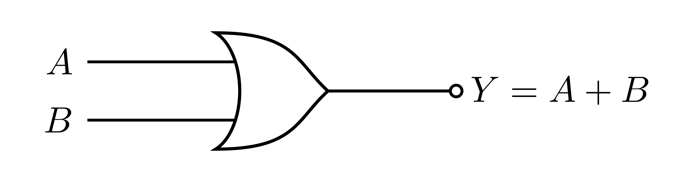
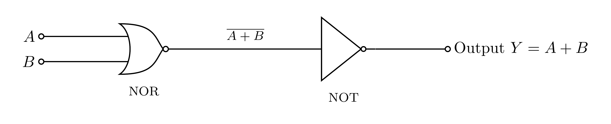

# OR Gate

An OR gate outputs `1` **when at least one input is `1`** (`Y = A + B`).

### Symbol



### Truth table

| `A` | `B` | `Y` |
|:---:|:---:|:---:|
| 0 | 0 | 0 |
| 0 | 1 | 1 |
| 1 | 0 | 1 |
| 1 | 1 | 1 |

`Y = A + B`

---

## What `0` and `1` really mean

`0` is **not** an empty wire; it is the output **actively connected to ground (0 V)**
through a conducting transistor. `1` is the output connected to **+5 V**. A wire connected
to *nothing* is a separate, undefined **floating** state, which we always avoid.

---

## How it is built

The natural transistor gate is NOR (parallel transistors), so we make OR by **inverting a
NOR**:

> OR = NOT(NOR(A, B)) = A + B

- **Stage 1 (NOR):** Q1 and Q2 in parallel with a shared pull-up `R_C1`. Output = `NOT(A+B)`.
- **Stage 2 (NOT):** a single NOT gate (Q3) flips that back to `A + B`.



How it works:

- **A or B is `1`:** stage 1 (NOR) output goes **low**, so Q3 turns OFF and the final output
  is **pulled up to +5 V** → `1`.
- **Both `0`:** stage 1 output goes **high**, Q3 turns ON and **pulls the output to ground**
  → `0`.

So `Y = A + B`.

---

## Components

### Transistors: 2N3904  (×3: Q1, Q2, Q3)

- **Type:** **NPN** *bipolar junction transistor* (BJT), a current-controlled switch: a
  small current into the **base** lets a much larger current flow from **collector** to
  **emitter**. Here each transistor is used fully on/off, as a switch.
- **Package:** TO-92 (small black half-cylinder of plastic with 3 legs).
- **Pinout:** hold it with the **flat face toward you and the legs pointing down**, and the pins
  are **E, B, C** (Emitter, Base, Collector) from left to right.
- **Key ratings:** V_CE ≈ **40 V** max, I_C ≈ **200 mA** max, current gain *hFE* ≈ **100–300**.
- **Why NPN (not PNP)?** Every emitter sits at **ground**, so a HIGH (+5 V) on a base turns
  that transistor ON and drags its collector **down to ground**, the switching action used
  by both the NOR stage (Q1, Q2) and the NOT-gate stage (Q3). A PNP would need re-wiring.
- **Substitutes:** 2N2222, PN2222, BC547, or any general-purpose NPN. **Re-check the pinout.**

### Resistors

| Ref | Value | Job |
|:---:|:-----:|:----|
| R_B1, R_B2, R_B3 | **10 kΩ** | **Base resistors**, one per transistor; limit base current while switching it fully on. |
| R_C1, R_C3 | **1 kΩ**  | **Collector pull-ups**, provide the HIGH (+5 V) level for the NOR stage (`R_C1`) and the NOT-gate stage (`R_C3`). |

### Power

- A **+5 V** supply rail and a common **GND** (0 V) reference.

---

## Standards and references

**Gate symbol.** The distinctive-shape symbol follows the ANSI/IEEE standard for logic graphic symbols:

- IEEE Std 91-1984 and 91a-1991, *Graphic Symbols for Logic Functions* ([standards.ieee.org](https://standards.ieee.org/ieee/91_91a/241/)). The distinctive shapes originate from US MIL-STD-806; the international equivalent is IEC 60617-12.
- Free explainer: Texas Instruments, *Overview of IEEE Standard 91-1984* (PDF) ([ti.com](https://www.ti.com/lit/ml/sdyz001a/sdyz001a.pdf)).
- Symbols and truth tables overview: *Logic gate*, Wikipedia ([wikipedia.org](https://en.wikipedia.org/wiki/Logic_gate)).

**Transistor circuit.** This OR gate is an RTL NOR stage followed by a NOT stage (OR = NOT of NOR). It follows standard transistor switch logic / RTL:

- *Resistor-Transistor Logic (RTL)*, Wikipedia ([wikipedia.org](https://en.wikipedia.org/wiki/Resistor%E2%80%93transistor_logic)).
- *NOR and NAND gates using transistor*, TheoryCircuit ([theorycircuit.com](https://theorycircuit.com/digital-electronics/nor-and-nand-gates-using-transistor/)).
- *Logic Gates using Transistors*, Electronics Tutorials ([electronics-tutorials.ws](https://www.electronics-tutorials.ws/logic/logic-gates-using-transistors.html)).
- P. Horowitz and W. Hill, *The Art of Electronics*, 3rd ed., Cambridge University Press, 2015 (the BJT used as a switch).
- A. S. Sedra and K. C. Smith, *Microelectronic Circuits*, Oxford University Press (BJT switch and the logic inverter).
- T. L. Floyd, *Digital Fundamentals*, Pearson (logic-gate symbols and truth tables).

**Transistor part.** 2N3904 NPN, onsemi datasheet ([PDF](https://www.onsemi.com/pdf/datasheet/2n3904-d.pdf)), product page ([onsemi.com](https://www.onsemi.com/products/discrete-power-modules/general-purpose-and-low-vcesat-transistors/2n3904)).

**Highlighted source (additional).** The exact building block this design uses, scroll-to-text highlighted on the Wikipedia RTL page: [“a common-emitter stage with a base resistor”](https://en.wikipedia.org/wiki/Resistor%E2%80%93transistor_logic#:~:text=common-emitter%20stage%20with%20a%20base%20resistor).

---

## Regenerating the diagrams

```bash
pdflatex circuit.tex
pdflatex symbol.tex
pdftoppm -png -r 600 circuit.pdf images/circuit   # -> images/circuit-1.png
pdftoppm -png -r 600 symbol.pdf  images/symbol     # -> images/symbol-1.png
```

> Use `pdftoppm`, not `pdftocairo`, at high DPI the Cairo backend can garble the fonts.
